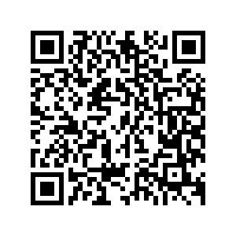
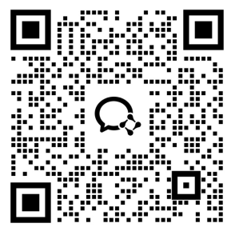
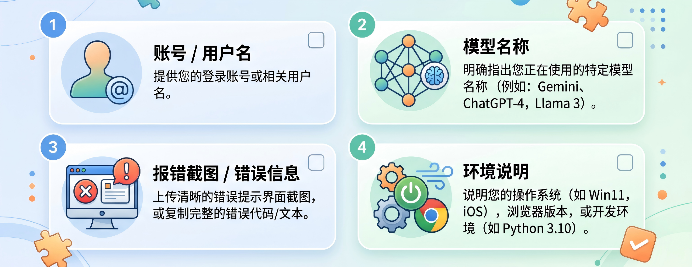

在使用无限星河AI的过程中，无论您是遇到了技术难题、有商务合作意向，还是需要反馈使用问题，都可以通过以下方式联系我们。

---

## 1. 客户支持与技术咨询

如果您在 API 调用、卡密兑换或账户使用中遇到问题，请通过以下方式联系我们的技术支持团队。

* **微信客服**：请扫码联系技术支持。

* **服务时间**：周一至周日 9:00 - 22:00（法定节假日视公告而定）

---

## 2. 商务合作

针对大额充值定制、企业级 API 接入、开发者生态入驻等商务合作，请联系商务专员：

* **企业微信**：请扫码添加商务专员进行深度洽谈。

* **合作备注**：添加时请备注“公司名称 + 合作意向”，以便我们快速响应。

---

## 3. 故障反馈建议流程

为了能以更快的速度为您解决问题，在联系客服时，建议您提供以下完整信息：

1. **基本信息**：您的无限星河账号用户名。
2. **问题描述**：您正在调用的具体模型（如 `gpt-4o` 或 `claude-3-7-sonnet`）。
3. **报错详情**：
   * 报错的状态码（如 401、402、502）。
   * 报错信息的完整截图或日志。
4. **测试情况**：请说明该问题是在您自己的软件中出现，还是在后台 **[渠道管理]** 页面进行渠道测试时也同样出现。

---

## 4. 公告与动态

如有模型更新、费率调整或服务变更，请以后台公告信息为准。

* **公告栏**：请留意登录后台后的 **[系统公告]** 区域。
