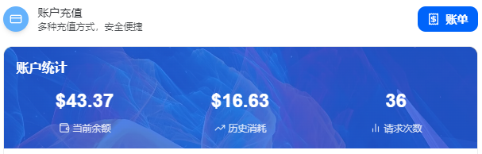

付款成功后，系统会自动发货。按下面 4 步操作，即可完成领取和兑换。

## 第一步：下单并等待自动发货

1. 在电商平台选择对应商品并完成付款。
2. 支付成功后，系统会自动发货。
3. 系统自动发货后，聊天页面会收到提取链接。

## 第二步：进入提取页面并领取兑换码

1. 点击聊天页面中的提取链接进入提取页。
2. 按页面要求核对订单信息；如需输入订单号，请确保填写正确。
3. 进入提取页后，领取兑换码，并查看使用说明或操作提示。

## 第三步：前往官网兑换

1. 在提取页中完整复制兑换码。
2. 打开浏览器，登录 [无限星河AI 官网](https://infistar.ai)。
3. 在左侧导航栏中，找到 **[钱包管理]** 菜单，进入兑换码填写区域。
4. 将兑换码完整粘贴到输入框中。
5. 粘贴后请检查首尾是否有多余的空格或特殊字符，以免兑换失败。
6. 点击 **[立即兑换]**。

## 第四步：查看到账结果

1. 系统提示“兑换成功”后，页面会自动跳转或刷新。
2. 进入 **[钱包管理]**，查看您的美元余额。
3. **计算标准**：平台采用 1:1 比例，即 1 元人民币面值的卡密 = 1 美元账户额度。

## 常见提示

* 若支付后未立即收到自动发货消息，请先刷新聊天页面并稍等片刻。
* 若提取页无法打开，请先检查网络环境，并确认链接来自聊天页面或官方客服。
* 若兑换失败，请保留订单截图、提取页截图和官网报错信息，便于客服核查。

