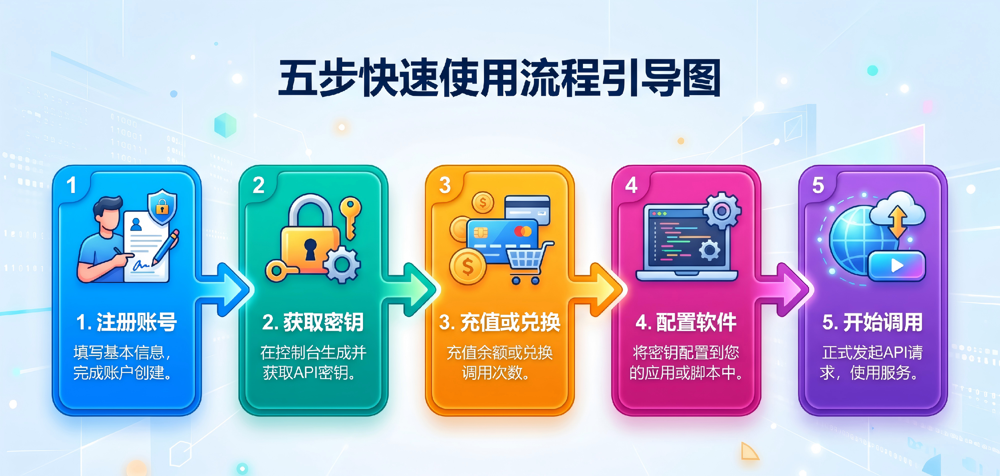
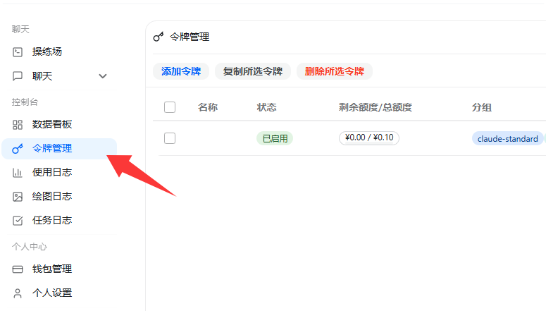
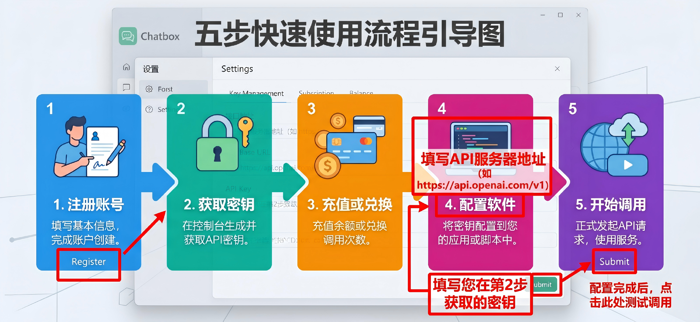

为了让您能够以最快的速度接入并使用我们的服务，我们对全流程进行了极简优化。只需跟着以下五个步骤，即可轻松开启您的 AI 之旅。

---

## 第一步：极速注册账号

我们极其重视用户的隐私与便利性。目前，无限星河AI 开放了**极简免验证入驻通道**。
* 您只需在官网首页点击“注册”。
* 填写您自定义的用户名和密码。
* 点击提交，即可瞬间完成注册，全程无需绑定手机号或邮箱，免去隐私泄露的担忧。

## 第二步：获取您的专属令牌

令牌即您的 API Key，是调用各大模型时的身份凭证，请务必妥善保管。
1. 登录无限星河AI 后台。
2. 在左侧导航栏找到并点击 **[令牌管理]**。
3. 点击“添加令牌”按钮，先完成令牌名称、基础信息、额度设置与访问限制等配置。
4. 确认配置无误后再创建令牌，并妥善保存后续用于调用的令牌信息。

## 第三步：充值或兑换余额

为了发起对话，您的账户中需要有充足的可用余额。
* **官方在线充值**：前往“个人中心 -> 钱包管理”，选择金额后，使用微信或支付宝直接扫码支付，余额即刻秒到账。
* **电商卡密兑换**：如果您在我们的淘宝店铺购买了充值卡密，请点击顶部的“兑换码/卡密兑换”，粘贴您的卡密即可完成充值。

## 第四步：在目标软件中配置中转

这是最关键的一步。无限星河AI 兼容市面上 99% 支持自定义接口的 AI 软件（如沉浸式翻译、Chatbox、SillyTavern 酒馆等）。
在这些软件的设置中，您通常只需要修改两处：
1. **接口地址 (Base URL / API URL)**：优先填写 OpenAI 兼容地址 `https://infistar.ai/v1`；如个别软件会自动补全 `/v1`，则按对应教程填写根域名 `https://infistar.ai`。
2. **API Key / 密钥**：填入您在第二步中获取的令牌（`sk-` 密钥）。

## 第五步：选择模型，开始调用！

配置完成后，您只需在软件的模型选择下拉菜单中，手写输入或选择您想要测试的模型名称（例如 `gpt-4o` 或 `claude-3-5-sonnet`），发送一句“你好”，如果收到 AI 的回复，恭喜您，配置大功告成！

