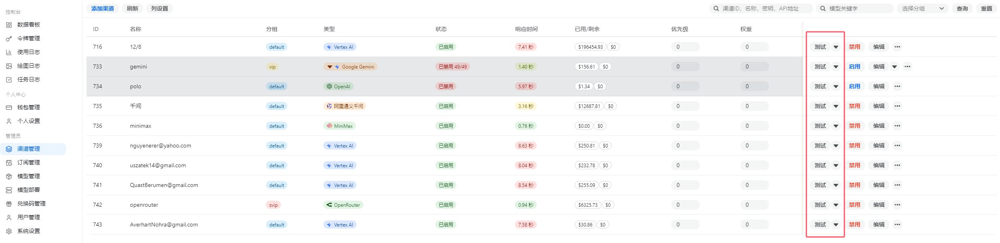

欢迎来到无限星河AI。如果您是第一次使用 API 服务，本指南将帮助您在 3 分钟内完成从账号注册到发起第一次 AI 对话的全过程。

## 一、 账号入驻

### 1. 注册与登录

* **极简注册**：访问官网注册页面。目前平台支持免邮箱/手机验证注册，您只需设置用户名和密码即可快速入驻。

* **安全性建议**：虽然注册过程极简，但请务必妥善保管您的密码。建议在首次登录后，在个人设置中完善您的密保信息。

### 2. 账号控制台概览

登录后，您将进入管理后台。在这里您可以一目了然地看到：

* **账户余额**：当前可用的美元金额（1 RMB = 1 $）。

* **今日消耗**：今日产生的 Token 消耗统计。

* **快捷入口**：包含令牌管理、财务充值、模型广场等核心功能。

---

## 二、 首调测试（后台直接测试）

为了确保渠道状态和基础配置正常，我们建议您在接入第三方软件前，先在后台完成一次简单的首调测试。

### 步骤 1：进入渠道管理页面

在左侧导航栏点击 **[渠道管理]**，进入渠道列表页面。

### 步骤 2：选择目标渠道并点击测试

在渠道列表中找到您准备使用的目标渠道，点击右侧操作栏中的 **[测试]** 按钮。

* **优先选择目标模型对应的渠道**：例如 OpenAI、Gemini 或 OpenRouter 等。
* **按分组确认可用范围**：如果您有 `default`、`vip` 等不同分组，请确认当前渠道归属是否正确。

### 步骤 3：确认渠道状态

如果测试结果正常，通常说明：

* 您的账号状态正常且余额充足。
* 当前渠道可用，模型网关连通性正常。
* 您的 API 服务已经准备就绪，可以继续接入到第三方软件中。

---

## 三、 接下来该做什么？

完成首调测试后，您可以：

1. **获取令牌**：前往“令牌管理”页面创建您的专属令牌。

2. **接入软件**：参考我们的《软件与客户端集成》文档，将 Key 配置到沉浸式翻译、Chatbox 或酒馆中。

3. **查阅费率**：在“模型广场”页面了解您关注模型的具体消耗标准。
