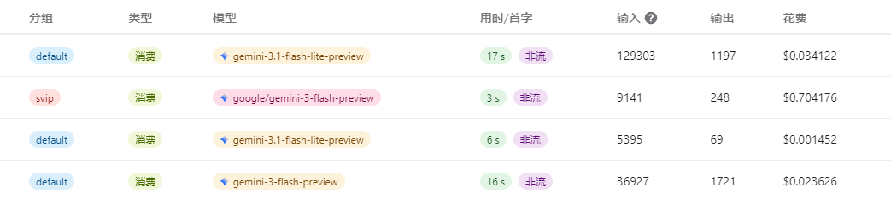

无限星河AI 致力于为用户提供透明、便捷的财务管理体验。我们的计费体系直接挂钩主流模型原厂定价，确保每一笔消费都清晰可查。

## 一、 充值比例说明

为了简化汇率换算的复杂性，平台采用固定比例的直观结算方式：

* **换算公式**：**1 元人民币 (RMB) = 1 美元 ($)**。

* **政策优势**：平台账户中的余额以“美元”显示，方便您直接对照 OpenAI 或 Claude 等官方文档的 Token 价格进行成本预估，无需手动计算实时汇率。

## 二、 充值方式引导

平台支持多种便捷的充值渠道，所有充值金额均实时自动到账。

### 1. 官方直接支付

您可以在导航栏内的个人中心通过在线支付快速补充余额：

* **操作步骤**：进入“个人中心” -> “钱包管理” -> 选择或输入充值金额 -> 选择“微信”或“支付宝” -> 扫码支付。

* **到账时间**：支付完成后，系统将自动秒级更新您的账户余额。

### 2. 电商卡密兑换

如果您是通过淘宝店铺购买的卡密，请使用兑换功能：

* **操作步骤**：进入“个人中心” -> “钱包管理” -> 在兑换码填写区域输入 16 位或 32 位兑换码 -> 点击确认。

* **适用场景**：适合需要通过电商平台获取发票或享受店铺促销活动的客户。

## 三、 充值记录与使用日志

我们为您提供清晰的记录查询能力，方便查看充值情况与日常使用明细。

### 1. 充值记录

记录每一笔资金存入的时间、来源（在线支付或兑换码充值）以及处理状态。

### 2. 使用日志

这是查看日常调用情况的核心记录。每当您发起一次 API 请求，使用日志中都会产生一条对应的记录，包含以下关键信息：

* **调用时间**：精确到秒。

* **模型名称**：明确展示使用的是哪种模型（如 GPT-4o）。

* **消耗详情**：显示该次请求的输入 Token、输出 Token 以及对应的扣费情况。

* **扣费总额**：根据对应模型的实时倍率计算出的美元扣除金额。

## 四、 财务安全建议

* **余额预警**：建议关注账户余额，当余额低于一定阈值时，建议及时补充，以免因欠费导致您的应用接口突然失效。

* **密钥管理**：令牌（API Key）等同于您的钱包钥匙，请勿将其泄露给他人。若怀疑密钥泄露，请立即在控制台重置令牌。

## 五、 售后规则

* **自动充值**：系统为自动化结算，暂不支持手动充值撤回。

* **退款说明**：由于 API 服务属于实时消耗类虚拟商品，余额一旦充入账户或卡密一旦核销，除由于本平台服务完全无法使用的情况外，通常不予退款。
