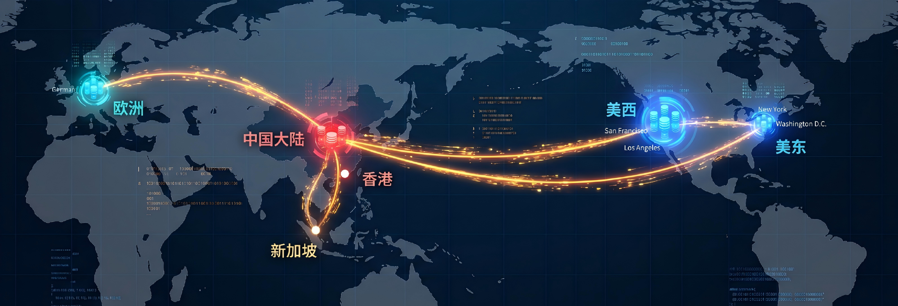
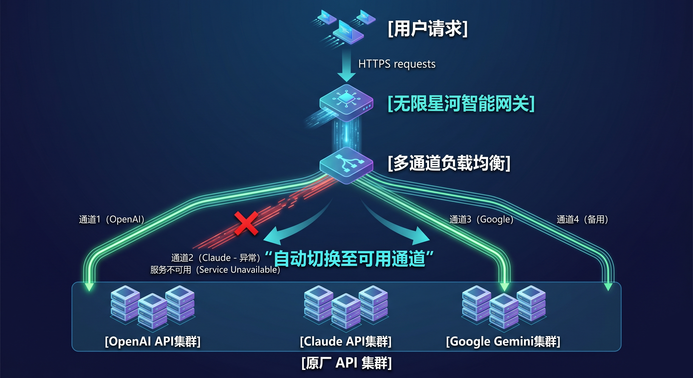

欢迎来到无限星河AI。我们希望通过清晰、稳定的接入方式，帮助用户更方便地使用主流大模型服务。

## 平台简介

无限星河AI 面向个人开发者、中小企业以及 AI 爱好者，提供稳定、高效、易接入的模型中转服务。我们理解很多用户在使用大模型时，会遇到网络延迟、接口成本较高以及注册与接入流程较繁琐等问题。

因此，我们将常见模型接入方式集中到同一个平台中。您只需要一个无限星河账号，即可调用 **OpenAI GPT 系列、Anthropic Claude 系列以及 Google Gemini 系列** 等主流模型，并兼容常见 AI 软件生态。

## 我们的核心优势

### 1. 稳定的网络响应体验

我们采用多节点路由与调度机制，会根据当前网络状态和访问区域分配较优的中转链路，以提升请求的稳定性与响应效率，减少长时间等待或连接中断等情况。

### 2. 主流模型一站式聚合

无需再为各个大模型平台分别准备海外银行卡、手机号或复杂的网络环境。无限星河AI 已完成全协议兼容（完全兼容 OpenAI API 格式）。您只需使用我们提供的基础地址和密钥，即可在常见客户端或开发环境中切换不同模型。

### 3. 高可用灾备架构

我们的网关配备了持续的健康检测与路由切换机制。当下游某一官方接口渠道出现拥堵或异常时，系统会自动切换至可用通道，以提升整体可用性与稳定性。

### 4. 计费透明与成本可预估

平台不设置隐形收费，计费规则以 Token 消耗为基础，并尽量保持与主流模型官方定价体系一致，方便用户进行成本预估与对比。
