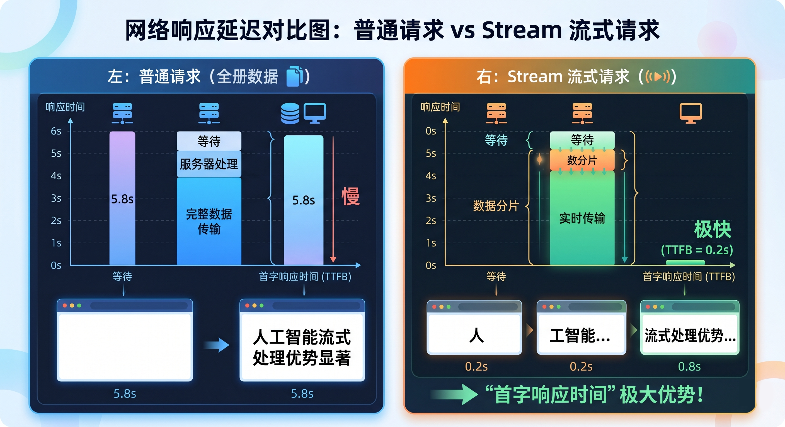

---
title: API 网关配置规范
---

本指南旨在帮助开发者正确配置无限星河AI 的中转网关，确保您的应用能够稳定、安全地调用顶尖大模型。

---

## 1. 核心接入地址

无限星河AI 提供统一的 API 入口，所有模型请求均通过该网关进行智能调度。

* **API 基础地址 (Base URL)**：`http://infistar.ai/v1`
* **协议支持**：仅支持 HTTPS 加密传输。


---

## 2. 鉴权与认证 (Authentication)

我们采用标准的 **Bearer Token** 认证机制，该方式与 OpenAI 官方协议完全兼容。

### 配置方式
在您的 HTTP 请求 Header 中添加以下字段：
`Authorization: Bearer 您的API_KEY`

### 注意事项
* **安全性**：API Key 等同于您的账户资产。请勿将 Key 直接硬编码在前端代码（如 HTML/JS）中，建议通过后端中转调用，防止 Key 被恶意抓取。
* **状态检查**：若鉴权失败，系统将返回 `401 Unauthorized` 状态码。

---

## 3. 网络连接建议

为了获得最佳的调用体验，建议在配置时参考以下网络参数：

1.  **超时时间 (Timeout)**：
    由于大模型生成（尤其是推理模型如 o1 系列）需要较长的计算时间，建议将客户端的请求超时时间设置为 **60 秒 - 180 秒**。
2.  **长连接支持**：
    网关支持 `Connection: keep-alive`，建议开启以减少频繁握手带来的延迟。
3.  **流式输出 (Stream)**：
    强烈建议开启 `stream: true` 模式。这不仅能提供“打字机”式的用户体验，还能在长文本生成过程中有效避免因前端等待时间过长而导致的连接超时。



---

## 4. 跨域配置 (CORS)

如果您是在浏览器环境中直接调用（仅限测试场景），我们的网关已默认允许跨域请求。但为了生产环境的安全，我们依然推荐使用服务器后端代理。

---

## 5. 快速验证

您可以使用以下 cURL 命令快速测试网关连通性：

```bash
curl [http://infistar.ai/v1/chat/completions](http://infistar.ai/v1/chat/completions) \
  -H "Content-Type: application/json" \
  -H "Authorization: Bearer 您的API_KEY" \
  -d '{
    "model": "gpt-4o",
    "messages": [{"role": "user", "content": "Hello!"}]
  }'

