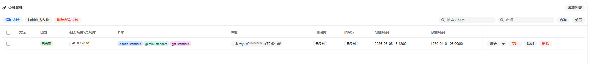
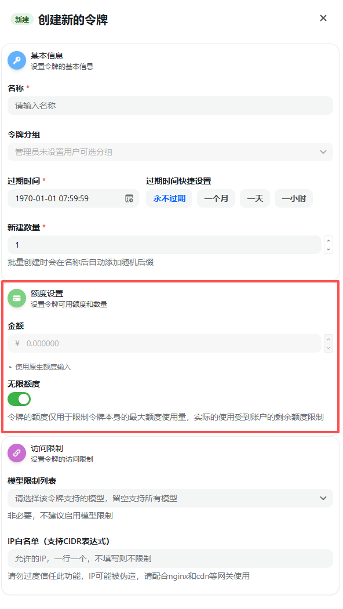

---
title: 身份认证与权限管理
---

为了确保您的账户资产安全和接口调用的合法性，无限星河AI 采用行业标准的认证协议。请开发者严格遵守本章的安全规范。

---

## 1. 认证机制 (API Key)

所有的 API 请求都必须通过 API Key（密钥）进行身份验证。

* **密钥格式**：以 `sk-` 开头的一串随机字符串。
* **获取路径**：登录控制台 -> 进入 **[令牌管理]** 页面 -> 点击“添加令牌”。
* **认证方式**：在 HTTP 请求头中添加 `Authorization` 字段。



---

## 2. 安全实践建议

API Key 具有操作您账户余额的最高权限，请务必遵循以下安全建议：

1. **禁止前端暴露**：
   * 严禁将 API Key 直接写在 HTML、Vue、React 等前端代码中。恶意用户可以通过浏览器的“开发者工具”轻松窃取您的 Key。
   * **推荐做法**：在您的服务器后端存储 Key，由后端发起请求并转发结果给前端。
2. **定期轮换**：
   * 建议每隔 3-6 个月更换一次 API Key。
3. **设置额度上限**：
   * 在创建令牌时，您可以为每个 Key 设置“额度上限（Quota）”。这样即使单个 Key 泄露，损失也会被控制在指定范围内。



---

## 3. 权限范围 (Scopes)

无限星河AI 提供的 API Key 默认拥有以下权限：

* **模型调用**：允许调用账号已解锁的所有大模型（GPT, Claude, Gemini）。
* **余额消耗**：允许根据模型费率实时消耗账户余额。
* **模型查询**：允许通过 `/v1/models` 接口查询可用列表。

*注：API Key **无法**用于修改您的登录密码、查看完整财务充值历史或提现，这些敏感操作必须通过官网登录后进行。*

---

## 4. 常见认证错误

当您的身份认证出现问题时，系统会返回相应的错误提示：

| 状态码 | 错误提示 (Message) | 排查建议 |
| :--- | :--- | :--- |
| **401** | `Invalid API Key` | 检查 Key 是否复制完整，或者该 Key 是否已被您手动删除。 |
| **401** | `Incorrect API Key provided` | 检查 Header 格式，确保包含 `Bearer `（注意后面有一个空格）。 |
| **403** | `Account Deactivated` | 您的账号可能因违反服务协议或涉及违规操作被封禁。 |
| **402** | `Insufficient Balance` | 认证成功但权限受限。您的余额已用完，无法发起新的模型调用。 |

---

## 5. 快速权限自检

您可以运行以下命令检查您的 Key 是否有效以及拥有哪些权限：

```bash
curl [http://infistar.ai/v1/models](http://infistar.ai/v1/models) \
  -H "Authorization: Bearer 您的API_KEY"

